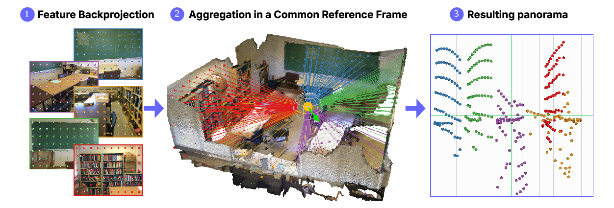
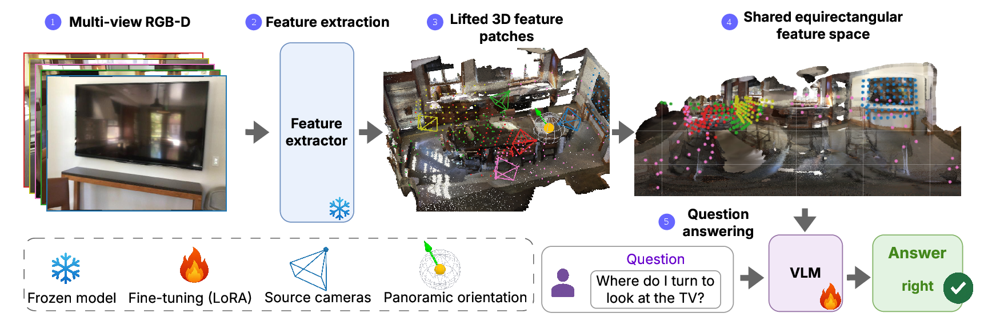
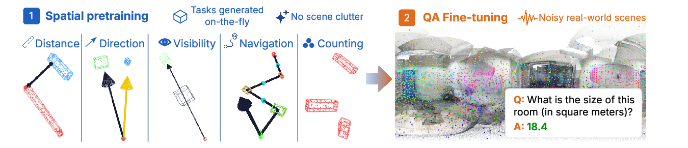

<div align="center">

# OneCanvas: 3D Scene Understanding via Panoramic Reprojection

[Bartłomiej Baranowski](https://baranowskibrt.github.io/)<sup>1</sup>, &nbsp;
[Dave Zhenyu Chen](https://daveredrum.github.io/)<sup>2</sup>, &nbsp;
[Matthias Nießner](https://niessnerlab.org/members/matthias_niessner/profile.html)<sup>1</sup>

<sup>1</sup> Technical University of Munich &nbsp;&nbsp; <sup>2</sup> Huawei

**NeurIPS 2026 (Spotlight)**

[](https://baranowskibrt.github.io/onecanvas/)
[](https://arxiv.org/abs/2606.19253)
[](https://arxiv.org/pdf/2606.19253)
[](https://www.youtube.com/watch?v=NIaHLB9gA7s)
[](https://huggingface.co/BaranowskiBrt/OneCanvas-Qwen3-VL-8B)



</div>

OneCanvas answers questions about a 3D scene. It takes the posed RGB-D views of
that scene, places every image patch at the 3D point it was observed from, and
spreads those patches over one panoramic canvas seen from a chosen viewpoint. A
vision-language model reads that single canvas next to the question and writes
the answer in text.

## Results

| Benchmark | Metric | OneCanvas-Qwen3-VL-8B |
|---|---|---:|
| SQA3D | EM@1 | 65.53 |
| VSI-Bench | Mean of eight category scores | 71.16 |
| SPBench (zero-shot) | Mean of SI and MV scores | 74.41 |

These are the scores of the downloadable model on the complete test sets,
measured with the commands in [Evaluate](#evaluate). Use them to check your
setup. [Benchmark protocols](#benchmark-protocols) states the exact aggregation
behind each metric, and reproducing any of them requires those settings. The
VSI-Bench figure uses gravity-upright ARKitScenes inputs.

## Method

A frozen feature extractor encodes each input view. Depth and camera pose lift
every patch feature into 3D, and each lifted patch keeps its own continuous
longitude and latitude on an equirectangular canvas built around the chosen
origin. Overlapping observations stay separate tokens, so nothing is fused or
resampled away. Angular position and source-frame index enter the model through
its MRoPE, and a small learned embedding supplies metric 3D coordinates. Only
the LoRA adapters and that embedding are trained.



## Checkpoints

The released model is base Qwen3-VL-8B-Instruct with the stage-1 curriculum
adapter and the stage-2 QA adapter merged in, carrying the trained 3D position
embedding. The directory is self-contained.

```bash
hf download BaranowskiBrt/OneCanvas-Qwen3-VL-8B --local-dir OneCanvas-Qwen3-VL-8B
```

`lineage.json` in the downloaded directory records which training checkpoints
were merged, in which order, and at which step. `resolved_config.json` carries
the canvas and geometry settings the benchmark runner reads back, and
`depth_embedding.pt` carries the 3D position embedding. All three are required.
Loading the weights alone gives a model with a randomly initialized geometry
channel and silently wrong metric answers.

The two training stages of the same model are on their own branches.

| Branch | Contents | Use it to |
|---|---|---|
| `stage1` | Stage-1 adapter, 3D position embedding, training config | Train your own stage 2 |
| `stage2` | Stage-2 adapter, 3D position embedding, training config, stage-1 adapter in `stage1_lora/` | Evaluate the unmerged adapters |

```bash
hf download BaranowskiBrt/OneCanvas-Qwen3-VL-8B --revision stage1 \
  --local-dir OneCanvas-stage1
hf download BaranowskiBrt/OneCanvas-Qwen3-VL-8B --revision stage2 \
  --local-dir OneCanvas-stage2
```

The stage-1 adapter applies to the **base** Qwen3-VL-8B-Instruct, not to the
merged model above.

## Load the model and answer a question

This is the shortest path from a downloaded checkpoint to an answer, and the
check to run first on a new machine. It needs one scene's posed RGB-D frames,
prepared as in [Dataset preparation](docs/DATA.md).

```python
from inference import load_onecanvas_model, process_vision_and_generate

CKPT = "OneCanvas-Qwen3-VL-8B"

model, processor = load_onecanvas_model(CKPT)  # includes required geometry state

answer = process_vision_and_generate(
    model, processor,
    question="How many chairs are in this room?",   # given to the model verbatim
    image_paths=frame_paths,   # list of N RGB frames, evenly spaced over the scene
    poses=poses,               # [N, 4, 4] camera-to-world
    depths=depths,             # [N, H, W] MILLIMETRES, sensor-PNG convention
    intrinsics=intrinsics,     # [N, 4] (fx, fy, cx, cy)
    image_dims=image_dims,     # [N, 2] (W, H)
)
print(answer)
```

The question goes to the model exactly as written, in the format it was trained
and benchmarked on. A multiple-choice question lists its options on new lines
after the question (`"...?\nA. chair\nB. table"`), as in VSI-Bench, and a
situated question starts with the situation, as in SQA3D (`"I am facing the
window. What is on my left?"`).

Feed the frames the way the benchmarks do, or the answers drift:

- 32 frames spaced evenly over the scene, first and last included, in capture
  order, and only frames with a valid pose.
- 640x480 images (320x240 for SQA3D-style questions), with `intrinsics` in the
  pixel frame of exactly those images.
- A Z-up world and OpenCV cameras (x right, y down, z forward), with `poses`
  camera-to-world.
- Gravity-upright images. ARKitScenes stores frames in the sensor's landscape
  orientation, and the benchmark loader turns them upright first.
- For a situated question, place the canvas at the agent with
  `center_override=[x, y, z]` and `yaw_angle=` (radians). Otherwise the canvas is
  centred on the mean camera position, the VSI-Bench setting.

The published numbers use `attn_implementation="flash_attention_2"`. The default
`sdpa` can flip a few answers.

The directory name must contain `Qwen3-VL`. The benchmark runner routes the
model class by substring-matching the path name, and a miss falls through to a
different backbone without complaining.

Two failure modes are worth recognizing, because neither raises where it is
caused:

- Skipping `load_3d_embeddings` leaves the 3D position embedding randomly
  initialized. The model still answers, and categorical questions look roughly
  normal, but metric readouts collapse. Measured on the paper checkpoint the
  cost was 5.4 points of VSI-Bench overall (64.95 against 70.34), concentrated in
  room size and absolute distance, while SQA3D barely moved. A valid load prints
  `[depth_embed] Loaded depth embedding from ...`.
- `attn_implementation="flash_attention_2"` needs a matching CUDA toolchain.
  `sdpa` is the portable choice.

## Installation

Use Python 3.11 and a CUDA environment for training or model inference. From the
repository root, install the components you need.

```bash
pip install -e .                 # reprojection and inference
pip install -e '.[train,eval,data]'  # training, evaluation and data preparation
```

For this procedure, use the recorded environment constraints in
[Reproducing the training procedure](docs/REPRODUCING.md). Dependency minimums in `pyproject.toml` do
not define a tested environment. `constraints-published.txt` records an older
evaluation environment and is not the selected procedure's environment.

FlashAttention is optional and requires a matching CUDA toolchain. The code
uses PyTorch SDPA when it is unavailable. Predicted-geometry evaluation also
requires a separate Depth Anything 3 installation. Visualization helpers are
available through `pip install -e '.[viz]'`.

## Prepare the data

Download and prepare the scene data and annotations using [Dataset preparation](docs/DATA.md).
Datasets are distributed by their original providers and are not included here.

```bash
export ONECANVAS_DATA_ROOT=/path/to/datasets
export ONECANVAS_CHECKPOINT_DIR=/path/to/checkpoints
export WANDB_MODE=offline   # training logs to wandb, online needs `wandb login`
```

## Train



```bash
bash training/runs/train_stage1_curriculum.sh

STAGE1_CKPT="$ONECANVAS_CHECKPOINT_DIR/stage1_curriculum/checkpoint-30000" \
  bash training/runs/train_stage2_qa.sh
```

Stage 1 trains a rank-256 LoRA adapter and the 3D position embedding on the
procedural spatial curriculum, with the geometry-to-visual feature norm ratio
held at 0.5. Stage 2 merges that adapter into the base model, initializes a
fresh rank-64 adapter, and fine-tunes on the scene QA mixture with the geometry
scale free. The scripts handle the geometry-scale handoff.

The released model is stage-1 step 30,000 and stage-2 step 7,000 of this
procedure. Evaluated as unmerged adapters, the way a new run is scored, it
reaches 65.33 SQA3D, 70.81 VSI-Bench and 74.32 SPBench.
[Reproducing the training procedure](docs/REPRODUCING.md) gives the
configuration, hardware, environment and checkpoint selection. To train only
stage 2, start it from the released stage-1 adapter.

```bash
STAGE1_CKPT=OneCanvas-stage1 bash training/runs/train_stage2_qa.sh
```

## Evaluate

Reproduce the three released numbers on the downloaded checkpoint. The runner
detects a self-contained merged directory, applies its `resolved_config.json`
and skips LoRA loading.

```bash
# SQA3D, agent-pose canvas origin, 320x240
python training/run_benchmarks.py --model-path OneCanvas-Qwen3-VL-8B \
  --datasets sqa3d --image-resolution 320x240 --sqa3d-use-agent-pose

# VSI-Bench, 640x480, gravity-upright ARKitScenes inputs
python training/run_benchmarks.py --model-path OneCanvas-Qwen3-VL-8B \
  --datasets vsi_bench --image-resolution 640x480 --upright-arkit

# SPBench (zero-shot), queried-camera canvas origin, 640x480
python training/run_benchmarks.py --model-path OneCanvas-Qwen3-VL-8B \
  --datasets spbench --image-resolution 640x480 --spbench-use-camera-pose
python scripts/spbench_paper_table.py output/<exp>/spbench/qa_results_final.json
```

`training/run_benchmarks_ddp.py` takes the same arguments under `torchrun` and
is the practical choice for the full test splits. To evaluate the unmerged
adapters from the `stage2` branch, pass `--from-config OneCanvas-stage2` in
place of `--model-path`. For your own run, pass `--stage1-lora` and `--lora`.

### Benchmark protocols

Each headline number is a specific aggregation of `final_metrics.json`, and
the other overall-looking fields in that file are different quantities. Using
the wrong one moves a result by one to two points without any warning.

| Benchmark | Headline metric | Read it from | Inputs |
|---|---|---|---|
| SQA3D | `EM@1`, strict micro-average over all 3,519 test questions | `final_metrics.json` | 320x240, canvas origin at the annotated agent pose |
| VSI-Bench | `official_overall`, the mean of the eight per-category means over 5,130 questions | `final_metrics.json` | 640x480, canvas origin at the camera centroid, ARKitScenes frames gravity-upright |
| SPBench | mean of the SI and MV split averages | `scripts/spbench_paper_table.py` | 640x480, canvas origin at the queried camera pose |

- On VSI-Bench, `all_questions_average` is the flat mean over the 5,130
  questions and reads about 1.5 points higher than `official_overall`, because
  the flat mean overweights the larger categories.
- On SPBench, `official_overall` is the flat mean over 1,328 questions, and
  the benchmark is 1,009 single-image against 319 multi-view, so the flat mean
  is single-image dominated and reads about 2 points lower than the balanced
  figure. The two can move in opposite directions.
- SQA3D per-question-type rows in `final_metrics.json` are EM@R1, not EM@1.
  Recompute strict per-type EM@1 from `qa_results_final.json` when comparing
  per-type columns against published baselines.
- All three run on ground-truth sensor depth and poses (`--use-gt-all`, the
  default) and 32 evenly spaced frames per scene. ARKitScenes frames are turned gravity-upright by default, whatever
  the checkpoint's training config says. `--no-upright-arkit` reads them in the
  sensor's landscape orientation instead, which costs about a point on VSI-Bench. `--scenes-file` restricts a run to a listed scene subset.

Evaluation scores are sensitive to the canvas origin, which is why each
command names it. Measured on the paper checkpoint, SQA3D scores 65.3 at the
annotated agent pose and 61.2 at the scene centroid. SPBench moves by a
comparable margin, 69.8 against 62.8 on its flat `official_overall`, between
the queried camera pose and the default anchor.

A merged directory for your own run comes from
`scripts/export_merged_checkpoint.py`, given the stage-1 adapter and the
selected stage-2 adapter. Merging rounds weights in bfloat16 and can change
generated answers, so evaluate the merged artifact rather than carrying over
the scores measured on the adapters.

## Reproject a scene

The reprojection API works independently of a VLM.

```python
import torch
from onecanvas import reproject_scene   # or: from reprojection import reproject_scene

N, L, Hf, Wf, C = 8, 2, 16, 16, 256      # imgs, feat-layers, feat-H/W, channels
scene = reproject_scene(
    features=torch.randn(N, L, Hf, Wf, C),   # [N, N_layers, H_feat, W_feat, C]
    depths=torch.rand(N, 480, 640) * 4000.0, # [N, H, W] depth in MILLIMETRES (sensor-PNG convention), outputs in metres
    poses=torch.eye(4).repeat(N, 1, 1),      # [N, 4, 4] camera-to-world
    intrinsics=torch.tensor([[500., 500., 320., 240.]]).repeat(N, 1),  # fx,fy,cx,cy
    image_dims=torch.tensor([[640, 480]]).repeat(N, 1),               # (W, H)
)
# Inspect the number and shape of the projected tokens.
print(scene.n_valid, scene.embeds.shape)
```

The pose convention is camera-to-world, and `depths` may be `[N, H, W]` or
`[N, 1, H, W]`. See `reprojection/scene_reprojection.py` for the full signature
(`center_override`, `yaw_angle`) and `reprojection/types.py` for `ReprojectedScene`.

## Code structure

`geometry/` lifts observations into 3D, `reprojection/` constructs the canvas,
`model_adapters/` connects it to a VLM, and `training/` provides the curriculum,
fine-tuning, and benchmarks. See [Development](docs/DEVELOPMENT.md) for the
package map and extension points.

## Citation

If you use OneCanvas in your research, please cite:

```bibtex
@inproceedings{baranowski2026onecanvas,
  title     = {OneCanvas: 3D Scene Understanding via Panoramic Reprojection},
  author    = {Baranowski, Bart{\l}omiej and Chen, Dave Zhenyu and Nie{\ss}ner, Matthias},
  booktitle = {Advances in Neural Information Processing Systems (NeurIPS)},
  year      = {2026}
}
```

## License

OneCanvas is released under the MIT License (`LICENSE`). It includes code
derived from Apache-2.0 projects (Stanford Alpaca / FastChat in `train.py`,
Hugging Face Transformers in `qwen_mrope.py`). Their attribution notices and
the Apache-2.0 text are in `THIRD_PARTY_NOTICES.md`.
